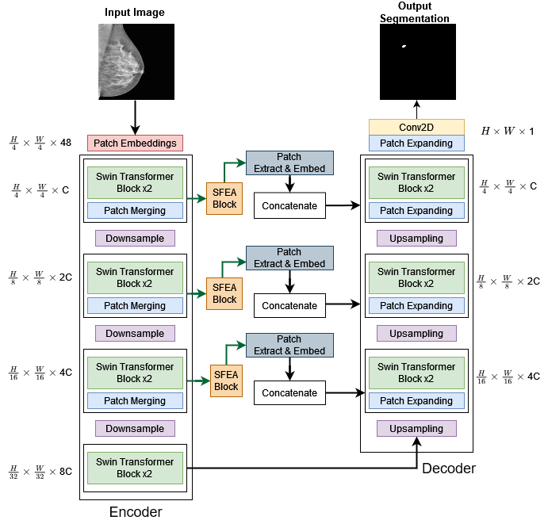
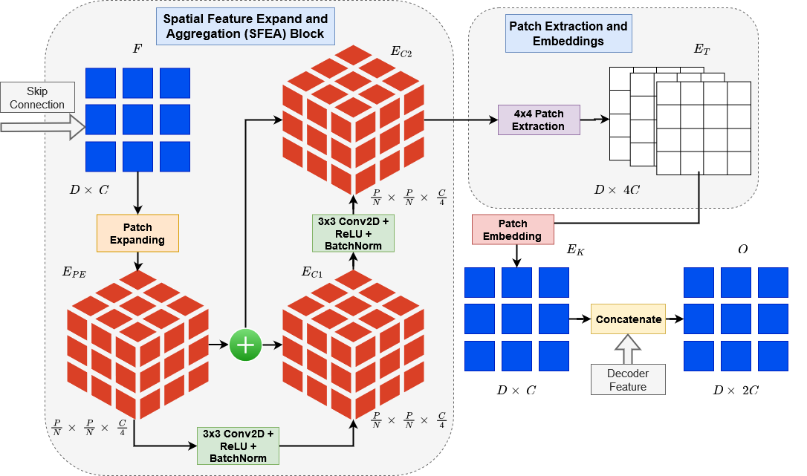
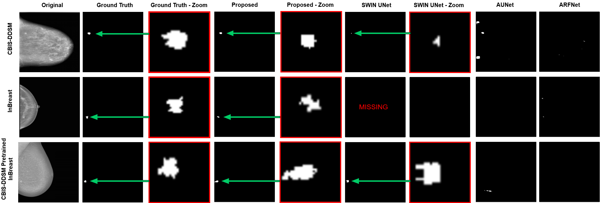

[](LICENSE)
[](https://arxiv.org/abs/2211.08717)
[](https://ieeexplore.ieee.org/abstract/document/10230342)

# \[ISBI 2023\] Swin-SFTNet: spatial feature expansion and aggregation using swin transformer for whole breast micro-mass segmentation


## <b>Equal Contribution</b>

Official PyTorch implementation of \[ISBI 2023\] [**Swin-sftnet: spatial feature expansion and aggregation using swin transformer for whole breast micro-mass segmentation**](https://arxiv.org/abs/2201.01266).

\[[Paper](https://arxiv.org/abs/2211.08717)\]\[[BibTex](#citing-SwinSFTNet)\]

<br clear="left"/>

---

## Abstract

Presenting Swin-SFTNet, a transformative U-net-shaped transformer-based architecture revolutionizing breast mass segmentation in mammography. By integrating the Spatial Feature Expansion and Aggregation Block (SFEA) with Swin transformer blocks, Swin-SFTNet excels in capturing both global and local features for enhanced segmentation accuracy. Additionally, a novel embedding loss function further refines the model's performance. Rigorous evaluation showcases Swin-SFTNet's superiority, achieving a segmentation dice improvement of 3.10% on CBIS-DDSM, 3.81% on InBreast, and 3.13% on the CBIS pre-trained model on the InBreast test dataset compared to state-of-the-art architectures.

<p float="left">
  
   
</p>

## Training

_Detail_Coming Soon_


## Results
### Visualize-Output:
Qualitative performance of Swin-SFTNet vs. other architectures on three datasets. (Red box) are zoomed-in images
<div align="left">
  
</div>


## Citing SwinSFTNet

If you find this repository useful, please consider giving a star and citation:

#### ISBI 2023 Reference:
```bibtex
@inproceedings{kamran2023swin,
  title={Swin-sftnet: spatial feature expansion and aggregation using swin transformer for whole breast micro-mass segmentation},
  author={Kamran, Sharif Amit and Hossain, Khondker Fariha and Tavakkoli, Alireza and Bebis, George and Baker, Sal},
  booktitle={2023 IEEE 20th International Symposium on Biomedical Imaging (ISBI)},
  pages={1--5},
  year={2023},
  organization={IEEE}
}
```

#### ArXiv Reference:
```bibtex
@article{amit2022swin,
  title={SWIN-SFTNet: Spatial Feature Expansion and Aggregation using Swin Transformer For Whole Breast micro-mass segmentation},
  author={Amit Kamran, Sharif and Fariha Hossain, Khondker and Tavakkoli, Alireza and Bebis, George and Baker, Sal},
  journal={arXiv e-prints},
  pages={arXiv--2211},
  year={2022}
}
```
